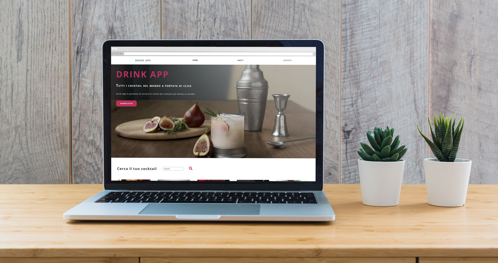

<h1 align="center">🍸 DRINK APP 🍸<h1>
<p align="center">
  
</p>
<br>
<hr height:"2"/>
<p>Drink App è una web app realizzata grazie al database di TheCocktailDB. L'utente può cercare un cocktail in base al nome o all'ingrediente e aprendo la scheda troverà tutte le informazioni sulla preparazione.</p>
<br>

<h3 >Tecnologie</h3>
<hr height:"2"/>
<ul>
    <li>HTML</li>
    <li>SASS</li>
    <li>Javascript</li>
    <li>NextJS</li>
    <li>ReactJS</li>
    <li>Axios</li>
    <li>Musement API</li>
</ul>
<br>

 <h3>Come avviare il progetto</h3>
 <hr height:"2"/>

Questo progetto [Next.js](https://nextjs.org/) è stato avviato con [`create-next-app`](https://github.com/vercel/next.js/tree/canary/packages/create-next-app).

Avvia il server di sviluppo:

```bash
npm run dev
# or
yarn dev
```

Apri [http://localhost:3000](http://localhost:3000) nel tuo browser per vedere il risultato.

Puoi modificare direttamente `pages/index.js` e la pagina si aggiornerà automaticamente.
<br>
